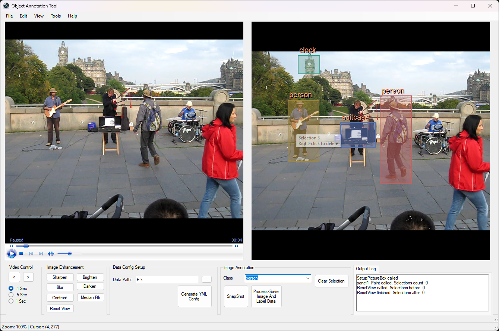

<div align="center">


# **C# Desktop Tool for Efficient Video Frame Annotation**
[](https://opensource.org/licenses/MIT)

</div>


The **Video Annotation Tool for Object Detection** is a robust C# desktop application designed to streamline the process of creating high-quality training datasets for object detection models through efficient video frame annotation. Built to optimize computer vision data preparation workflows, this tool offers an intuitive interface and precise controls for accurate object labeling, making it ideal for tasks like object detection, tracking, and segmentation.

---

## Key Features

- **Video Frame Extraction**: Capture and annotate specific frames from video sources with ease.
- **Precise Annotation Tools**: Draw tight bounding boxes with click-drag controls to accurately define objects of interest.
- **Multi-Class Support**: Manage multiple classes via quick-access dropdown menus, supporting a diverse range of object types.
- **Image Enhancement**: Adjust image quality directly in the tool with options for sharpening, blurring, contrast, brightness, and median filter adjustments.
- **Popular Model Format Export**: Generate Popular Model-compatible datasets, with annotations in YOLO format for seamless training integration.
- **Batch Processing**: Efficiently process and annotate multiple frames in one session, enhancing productivity.
- **Configurable Settings**: Customize class sets and annotation parameters to fit project needs.

<div align="center">



</div>

---

## Professional Annotation Features

- **Occlusion Handling**: Annotate occluded objects for comprehensive object detection training.
- **Complete Coverage Enforcement**: Ensure full object boundaries for accurate dataset creation.
- **Annotation Consistency**: Incorporate labeling guidelines to maintain standardization across teams.
- **Real-Time Coordinate Tracking**: Track annotation positions and adjustments in real-time.
- **Advanced Zoom and View Controls**: Multi-level zoom and panning options for detailed annotation work.

---

## Keyboard Shortcuts for Enhanced Workflow

- `Ctrl + / -`: Zoom in/out
- `Ctrl + 0`: Reset view
- `Ctrl + S`: Save annotations to popular object model format
- `Ctrl + Y`: Generate YAML configuration
- `Ctrl + C`: Clear selections
- `Arrow Keys`: Navigate video frames
- `Space`: Capture a frame for annotation
- `Delete`: Remove selected annotation box
- `P`: Play/Pause video

---

## Quick Start Guide

1. **Load Media**:
   - Import images or load video files to start annotating.

2. **Annotate Objects**:
   - Choose a class, then click-drag to create bounding boxes. Use `Shift` to resize or adjust as needed.

3. **Export Dataset**:
   - Save annotated data directly in YOLOv5 format with generated YAML configurations for model training.

---

## Best Practices for Accurate Annotation

- Ensure tight, precise bounding boxes.
- Label all instances, including partially visible objects.
- Follow consistent annotation standards across frames.
- Review labeling guidelines to maintain uniformity.

---

## Technical Details

- **Custom C# Implementation**: Optimized for efficient memory management and real-time processing.
- **Popular Format-Compatible Exports**: Create structured, validation-ready dataset files.
- **System Requirements**: Requires Windows OS, .NET Framework (specific version pending), and a minimum of 4GB RAM.

---

This tool simplifies the creation of consistent, high-quality training data for YOLOv5 models, boosting performance in object detection tasks across a wide range of applications.

---

## Contributing

We welcome contributions to improve this tool. Feel free to submit bug reports, feature requests, or code improvements through GitHub issues or pull requests.

---

## License

[MIT Licsense]

## Third Party Libraries

This project uses:
- YamlDotNet 15.1.1 (MIT License) - Copyright (c) 2008-2014 Antoine Aubry and contributors
---

By using this tool, you can significantly expedite the creation of high-quality training data for your Standard models, leading to more accurate and robust object detection and tracking systems.

```
